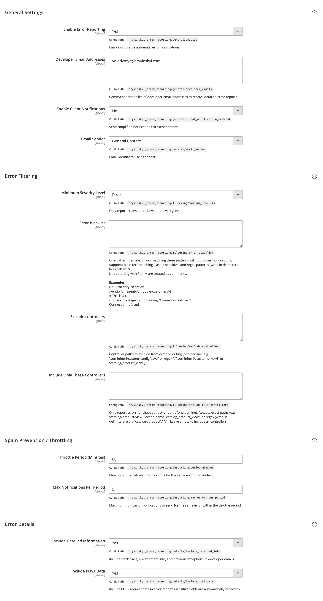
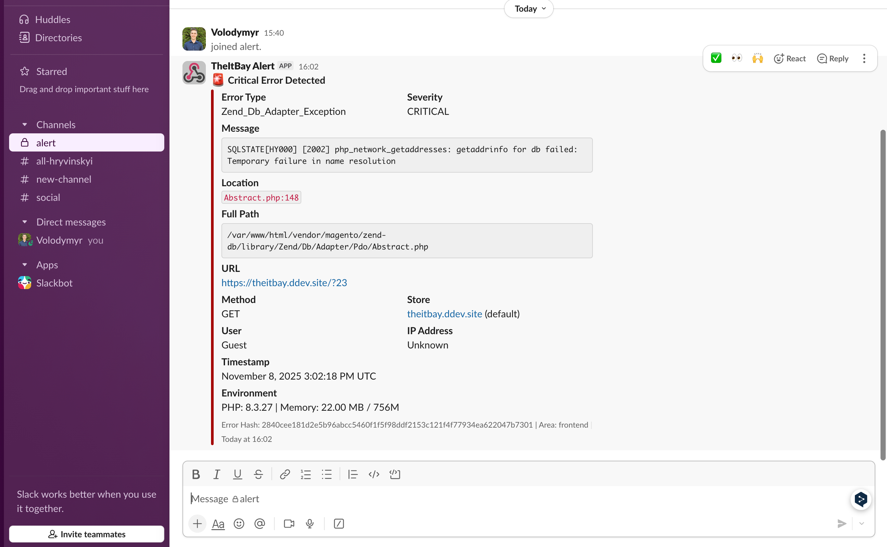
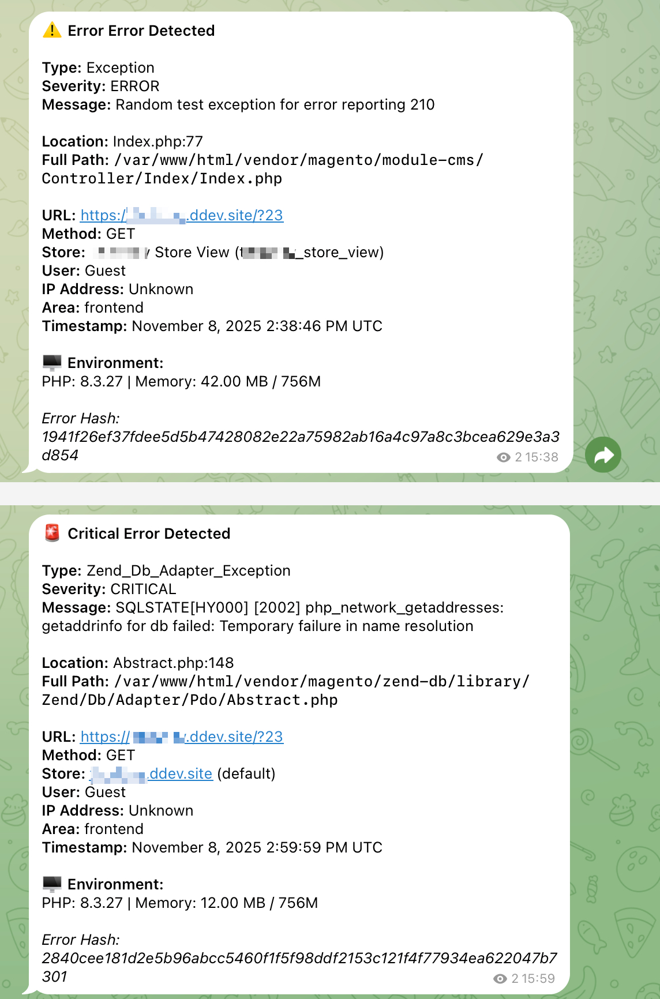

# Magento 2/Adobe Commerce - Error Email Notification Module

Advanced error notification system for Magento 2/Adobe Commerce, multiple notification channels, and comprehensive error tracking.

[](https://packagist.org/packages/hryvinskyi/magento2-error-reporting)
[](https://packagist.org/packages/hryvinskyi/magento2-error-reporting)
[](https://www.paypal.com/cgi-bin/webscr?cmd=_donations&business=volodymyr%40hryvinskyi%2ecom&lc=UA&item_name=Magento%202%20Error%20Email%20Notification%20Module&currency_code=USD&bn=PP%2dDonationsBF%3abtn_donateCC_LG%2egif%3aNonHosted "Donate once-off to this project using Paypal")
[](https://packagist.org/packages/hryvinskyi/magento2-error-reporting)
[](https://packagist.org/packages/hryvinskyi/magento2-error-reporting)

## Table of Contents

- [Features](#features)
- [Installation](#installation)
- [Configuration](#configuration)
  - [General Settings](#general-settings)
  - [Error Filtering](#error-filtering)
  - [Spam Prevention / Throttling](#spam-prevention--throttling)
  - [Error Details](#error-details)
  - [Email Notifications](#email-notifications)
  - [Slack Notifications](#slack-notifications)
  - [Microsoft Teams Notifications](#microsoft-teams-notifications)
  - [Telegram Notifications](#telegram-notifications)
  - [WhatsApp Notifications](#whatsapp-notifications)
- [Error Information Captured](#error-information-captured)
  - [For Developers (Detailed Email)](#for-developers-detailed-email)
  - [For Clients (Simplified Email)](#for-clients-simplified-email)
- [Notification Channels](#notification-channels)
- [Author](#author)
- [Support](#support)

## Features

### Core Features
- **Dual Email System** - Separate detailed emails for developers and simplified emails for clients
- **Multiple Notification Channels** - Email, Slack, Microsoft Teams, Telegram, and WhatsApp support
- **Smart Spam Prevention** - Configurable throttling to prevent notification flooding
- **Configurable Blacklist** - Filter out specific errors using patterns or regex
- **Controller Filtering** - Exclude or include specific controllers for error reporting
- **Severity Levels** - Critical, Error, and Warning levels with configurable minimum threshold per channel
- **Comprehensive Error Data** - Captures exception details, stack traces, request info, user context, post data, and server environment
- **Sensitive Data Protection** - Automatically redacts passwords, credit cards, and other sensitive data
- **Zero External Dependencies** - Works even when database, Redis, or other services are down to ensure error reporting is reliable

## Installation

### Composer (recommended)

```bash
composer require hryvinskyi/magento2-error-reporting
bin/magento module:enable Hryvinskyi_ErrorReporting
bin/magento setup:upgrade
bin/magento setup:di:compile
bin/magento setup:static-content:deploy
```

### Manual Installation

1. Download the module and upload it to `app/code/Hryvinskyi/ErrorReporting`
2. Enable the module and update the database:

```bash
bin/magento module:enable Hryvinskyi_ErrorReporting
bin/magento setup:upgrade
bin/magento setup:di:compile
bin/magento setup:static-content:deploy
```

## Configuration

Navigate to `Stores > Configuration > Advanced > Error Reporting` to configure the module settings:

<details>
<summary><b>Demo Image</b></summary>


</details>

### General Settings

**Enable Error Reporting**
- Enable or disable automatic error notifications
- When disabled, no errors will be reported through any channel

### Error Filtering

**Error Blacklist**
- One pattern per line
- Errors matching these patterns will not trigger notifications
- Supports plain text matching (case-insensitive) and regex patterns (wrap in delimiters like /pattern/)
- Lines starting with # or // are treated as comments
- Examples:
  - `NoSuchEntityException`
  - `/vendor\/magento\/module-customer\//i`
  - `Connection refused`

**Exclude Controllers**
- Controller paths to exclude from error reporting
- One per line
- Supports exact paths (e.g. "adminhtml/system_config/save"), action names (e.g. "catalog_product_view"), or regex patterns (e.g. "/^adminhtml\/customer\/.*/i")

**Include Only These Controllers**
- Only report errors for these controller paths
- One per line
- Accepts exact paths, action names, or regex patterns
- Leave empty to include all controllers

### Spam Prevention / Throttling

**Throttle Period (Minutes)**
- Minimum time between notifications for the same error
- Value in minutes
- Must be greater than zero

**Max Notifications Per Period**
- Maximum number of notifications to send for the same error within the throttle period
- Must be greater than zero

### Error Details

**Include Detailed Information**
- Include stack trace, environment info, and previous exceptions in developer emails

**Include POST Data**
- Include POST request data in error reports
- Sensitive fields are automatically redacted (passwords, credit cards, etc.)

### Email Notifications

<details>
<summary><b>Demo Image Developer email</b></summary>


</details>

<details>
<summary><b>Demo Image Client email</b></summary>


</details>

**Enable Email Notifications**
- Send error notifications via email

**Minimum Severity Level**
- Only send email notifications for errors at or above this severity level
- Options: Critical, Error, Warning

**Developer Email Addresses**
- Comma-separated list of developer email addresses
- Receives detailed error reports with full stack traces and technical information

**Enable Client Notifications**
- Send simplified notifications to client contacts

**Client Email Addresses**
- Comma-separated list of client email addresses
- Receives simplified error notifications without technical details

**Email Sender**
- Email identity to use as sender
- Select from configured email identities

### Slack Notifications

<details>
<summary><b>Demo Image</b></summary>


</details>

Send error notifications to Slack channels via incoming webhooks.

**Enable Slack Notifications**
- Send error notifications to Slack

**Minimum Severity**
- Only send notifications for errors at or above this severity level
- Options: Critical, Error, Warning

**Webhook URL** (required)
- Your Slack incoming webhook URL
- Format: `https://hooks.slack.com/services/XXX/YYY/ZZZ`
- Get your webhook URL: Workspace Settings > Apps > Incoming Webhooks > Add to Channel

**Channel Override** (optional)
- Override default channel
- Format: `#errors` or `@username`
- Leave empty to use webhook default

**Bot Username**
- Display name for the bot in Slack

### Telegram Notifications
<details>
<summary><b>Demo Image</b></summary>


</details>

Send error notifications to Telegram channels or chats via Telegram Bot API.

**Enable Telegram Notifications**
- Send error notifications to Telegram

**Minimum Severity**
- Only send notifications for errors at or above this severity level
- Options: Critical, Error, Warning

**Bot Token** (required)
- Your Telegram bot token from [@BotFather](https://t.me/botfather)
- Format: `123456789:ABCdefGHIjklMNOpqrsTUVwxyz`
- Create a bot with @BotFather to get your token

**Chat ID** (required)
- The chat ID or channel username where messages will be sent
- Format: `-1001234567890` for channels, or `@channelname`
- To get chat ID:
  1. Add the bot to your chat
  2. Send a message
  3. Use getUpdates method: `https://api.telegram.org/bot<YourBOTToken>/getUpdates`


### Microsoft Teams Notifications

**Status: ⚠️ NOT TESTED**

Send error notifications to Microsoft Teams channels via incoming webhooks.

**Enable Teams Notifications**
- Send error notifications to Microsoft Teams

**Minimum Severity**
- Only send notifications for errors at or above this severity level
- Options: Critical, Error, Warning

**Webhook URL** (required)
- Your Microsoft Teams incoming webhook URL
- Format: `https://outlook.office.com/webhook/...`
- Get your webhook URL: Channel Menu > Connectors > Incoming Webhook > Configure

### WhatsApp Notifications

**Status: ⚠️ NOT TESTED**

Send error notifications to WhatsApp via WhatsApp Business Cloud API.

**Enable WhatsApp Notifications**
- Send error notifications to WhatsApp

**Minimum Severity**
- Only send notifications for errors at or above this severity level
- Options: Critical, Error, Warning

**Access Token** (required)
- Your WhatsApp Business Account access token from Facebook Developer Portal
- Generate it in [Meta for Developers](https://developers.facebook.com/apps) dashboard
- Location: Your app > WhatsApp > API Setup section

**Phone Number ID** (required)
- Your WhatsApp Business Phone Number ID (not the phone number itself)
- Find this in the WhatsApp > API Setup section of your app
- Must be numeric digits only

**Recipient Phone Number** (required)
- The phone number to receive error notifications
- International format without + or spaces (e.g., `1234567890`)
- Must be registered with WhatsApp

**Getting Started:**
- Visit [WhatsApp Cloud API Documentation](https://developers.facebook.com/docs/whatsapp/cloud-api/get-started)
- Requires: Facebook Business Account, WhatsApp Business Account, and Cloud API access

## Error Information Captured

### For Developers (Detailed Email)

Comprehensive technical information for debugging:

- Exception type, message, file, and line number
- Full stack trace
- Previous exceptions chain
- Request details (URL, method, headers, POST data)
- Client information (IP address, user agent, referer)
- User context (guest, customer, or admin with details)
- Store context (store name, code, URL)
- Server environment (PHP version, memory usage, peak memory)

### For Clients (Simplified Email)

Non-technical error notification for stakeholders:

- General error notification
- Timestamp and location
- Reassurance that the issue is being addressed
- Clean, non-technical presentation
- No stack traces or technical details

## Notification Channels

The module supports multiple notification channels, each with independent configuration:

### Channel Configuration Examples

#### Slack Setup (Recommended)
1. Go to your Slack workspace
2. Navigate to: Workspace Settings > Apps > Incoming Webhooks
3. Click "Add to Channel"
4. Copy the webhook URL
5. Paste into Magento configuration

#### Telegram Setup
1. Create a bot with [@BotFather](https://t.me/botfather)
2. Get your bot token
3. Add the bot to your channel/chat
4. Get the chat ID using `getUpdates` API
5. Configure in Magento

#### Microsoft Teams Setup
**⚠️ Status: NOT TESTED - Use at your own risk**
1. Open your Teams channel
2. Click on channel menu (three dots)
3. Select Connectors > Incoming Webhook
4. Click Configure
5. Copy the webhook URL
6. Paste into Magento configuration

#### WhatsApp Setup
**⚠️ Status: NOT TESTED - Use at your own risk**
1. Create a Facebook Business Account
2. Set up WhatsApp Business Account
3. Get access to WhatsApp Cloud API
4. Generate access token from Meta for Developers
5. Get Phone Number ID from API Setup
6. Configure in Magento

## Author

**Volodymyr Hryvinskyi**
- Email: volodymyr@hryvinskyi.com
- GitHub: https://github.com/hryvinskyi

## Support

For issues, feature requests, or questions, please contact the author or submit an issue on GitHub.
