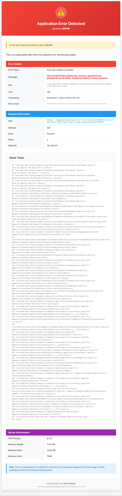
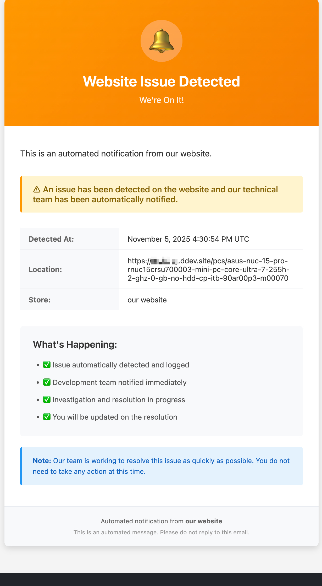

# Magento 2/Addobe Commerce - Error Email Notification Module

Advanced error notification system for Magento 2 with spam prevention, and comprehensive error tracking.

[](https://packagist.org/packages/hryvinskyi/magento2-error-reporting)
[](https://packagist.org/packages/hryvinskyi/magento2-error-reporting)
[](https://www.paypal.com/cgi-bin/webscr?cmd=_donations&business=volodymyr%40hryvinskyi%2ecom&lc=UA&item_name=Magento%202%20Error%20Email%20Notification%20Module&currency_code=USD&bn=PP%2dDonationsBF%3abtn_donateCC_LG%2egif%3aNonHosted "Donate once-off to this project using Paypal")
[](https://packagist.org/packages/hryvinskyi/magento2-error-reporting)
[](https://packagist.org/packages/hryvinskyi/magento2-error-reporting)


## Features

### Core Features
- **Dual Email System** - Separate detailed emails for developers and simplified emails for clients
- **Smart Spam Prevention** - Configurable throttling to prevent email flooding (filesystem-based)
- **Configurable Blacklist** - Filter out specific errors using patterns or regex
- **Severity Levels** - Critical, Error, and Warning levels with configurable minimum threshold
- **Comprehensive Error Data** - Captures exception details, stack traces, request info, user context, post data, and server environment
- **Filesystem-Based Tracking** - Error tracking stored in var/error_reporting (no database dependency)
- **Configuration Failover** - Automatically exports config to filesystem config (no database dependency)
- **Sensitive Data Protection** - Automatically redacts passwords, credit cards, and other sensitive data
- **Zero External Dependencies** - Works even when database, Redis, or other services are down to ensure error reporting is reliable

### Error Information Captured

#### For Developers (Detailed Email):
- Exception type, message, file, line number
- Full stack trace
- Previous exceptions chain
- Request details (URL, method, headers, POST data)
- Client information (IP address, user agent, referer)
- User context (guest, customer, or admin with details)
- Store context (store name, code, URL)
- Server environment (PHP version, memory usage, peak memory)
- Error frequency and occurrence count
 



#### For Clients (Simplified Email):
- General error notification
- Timestamp and location
- Reassurance that the issue is being addressed
- Clean, non-technical presentation



## Installation

### Composer (recommended)

```bash
composer require hryvinskyi/magento2-error-reporting
bin/magento module:enable Hryvinskyi_ErrorReporting
bin/magento setup:upgrade
bin/magento setup:di:compile
bin/magento setup:static-content:deploy
```

### Manual Installation

1. Download the module and upload it to `app/code/Hryvinskyi/ErrorReporting`
2. Enable the module and update the database:

```bash
bin/magento module:enable Hryvinskyi_ErrorReporting
bin/magento setup:upgrade
bin/magento setup:di:compile
bin/magento setup:static-content:deploy
```


## Author

**Volodymyr Hryvinskyi**
- Email: volodymyr@hryvinskyi.com
- GitHub: https://github.com/hryvinskyi

## Support

For issues, feature requests, or questions, please contact the author or submit an issue on GitHub.
